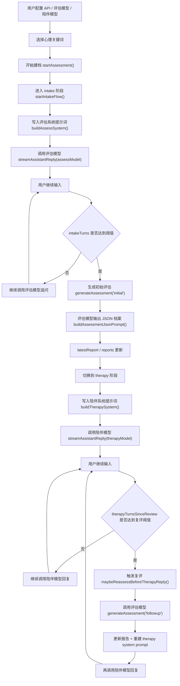
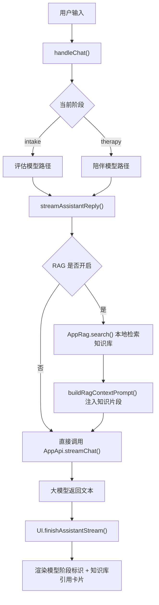

# 双模型架构说明

## 结论

当前项目已经实现了**真正的双模型串行架构**，不是“界面上有两个模型输入框，但实际上只调用一个模型”的伪双模型。

具体表现为：

- **评估模型**负责：
  - 首次建档开场提问
  - 建档阶段追问
  - 结构化 JSON 评估输出
  - 后续周期性复评
- **陪伴模型**负责：
  - 初评完成后的持续对话
  - 每次复评后的长期陪伴回复

两者当前共用：

- 同一个 API Base
- 同一个 API Key
- 同一个会话历史 `State.history`

但它们使用的是**不同的模型 ID、不同的系统提示词、不同的调用时机**。因此在工程上，这已经是双模型流程。

## 这不是哪一种“双模型”

它不是：

- 两个模型并行投票
- 一个模型生成、另一个模型裁判的并发仲裁架构
- 多 agent 协作系统

它是：

- **评估模型 + 陪伴模型**
- **按阶段串行切换**
- **按规则周期回评**

更准确的名字应当是：

- **双模型分阶段对话架构**
- **Assessment Model / Therapy Model Pipeline**

## 总体流程图

## RAG 合入后的流程图

## 关键函数映射

### 1. 模型配置入口

- `config.js`
  - `defaults.assessModel`
  - `defaults.therapyModel`
- `index.html`
  - `#cfgAssess`
  - `#cfgTherapy`
- `ui.js`
  - `writeSettings()`
  - `readSettings()`
- `main.js`
  - `loadSettings()`
  - `saveSettings()`

### 2. 评估模型调用路径

- `main.js`
  - `startIntakeFlow()`
    - 设置 `phase = 'intake'`
    - 写入 `buildAssessSystem()`
    - 调用 `streamAssistantReply({ model: assessModel })`
  - `generateAssessment(reportPhase)`
    - 调用 `Api.chat({ model: assessModel })`
    - 额外使用 `buildAssessmentJsonPrompt()`
    - 解析 JSON 并写入 `reports`

### 3. 陪伴模型调用路径

- `main.js`
  - `finishInitialAssessment()`
    - 初评完成后切到 `therapy`
    - `rebuildTherapyContext()`
    - 调用 `streamAssistantReply({ model: therapyModel })`
  - `handleChat()`
    - therapy 阶段下每轮都走 `streamAssistantReply({ model: therapyModel })`

### 4. 周期性回评路径

- `main.js`
  - `maybeReassessBeforeTherapyReply()`
    - 当 `therapyTurnsSinceReview >= reassessEvery`
    - 先调用 `generateAssessment('followup')`
    - 再 `rebuildTherapyContext()`
    - 最后重新调用陪伴模型

### 5. 实际 API 出口

- `api.js`
  - `AppApi.chat()`
  - `AppApi.streamChat()`

不管是评估模型还是陪伴模型，最终都从这里出网。差别在于传入的：

- `model`
- `messages`
- `temperature`
- `system prompt`

## 当前状态机

系统的显式状态机只有三个阶段：

- `idle`
- `intake`
- `therapy`

对应关系：

- `idle`: 未开始，不调用任何模型
- `intake`: 只调用评估模型
- `therapy`: 默认调用陪伴模型，但在达到复评阈值时会插入一次评估模型

所以从控制流看，真实逻辑是：

- **intake 阶段: assess only**
- **therapy 阶段: therapy main + assess checkpoint**

## 这次补强了什么

为了让“双模型”不只是代码里存在，而是运行时也能被观察到，本次增加了以下可见性：

- 每条助手消息都会记录：
  - `meta.model`
  - `meta.role`
  - `meta.stage`
  - `meta.stageLabel`
- 每次评估报告都会记录：
  - `report.meta.model`
  - `report.meta.role`
  - `report.meta.stage`
- 聊天气泡上方会显示：
  - `评估模型 · 建档追问 · qwen-turbo-latest`
  - 或 `陪伴模型 · 陪伴回复 · qwen3-max-preview`
- 报告面板会显示本次评估由哪个模型生成

这让你在 UI 上能直接验证：

- 当前说话的是哪个模型
- 当前阶段是建档、复评还是陪伴
- 双模型是否真的在切换

## 是否还存在架构限制

有，主要是这几个：

1. 现在是**单会话历史共享**
   - 评估模型和陪伴模型共用 `State.history`
   - 优点是上下文连续
   - 缺点是两个模型没有完全隔离的 memory

2. 现在是**单 API Base / 单 API Key**
   - 能支持两个模型 ID
   - 但还不支持“评估模型走供应商 A，陪伴模型走供应商 B”

3. 现在是**串行切换**而不是并行协作
   - 更稳定
   - 也更容易解释
   - 但不是 ensemble / arbitration 架构

## 如果你要画图，建议这样命名模块

- 前端状态层
- 关键词选择层
- 会话控制器
- 评估模型链路
- 陪伴模型链路
- 周期性复评链路
- 本地 RAG 检索链路
- 引用回显层

## 最适合你汇报时的一句话

这个项目不是单模型聊天，而是一个**“评估模型负责建档与追踪、陪伴模型负责持续对话、RAG 负责知识增强”的双模型分阶段心理支持架构**。
